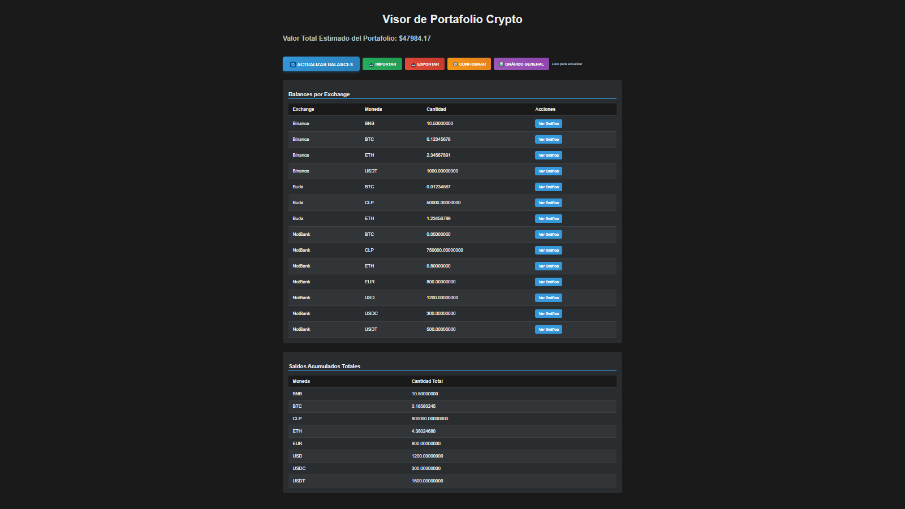
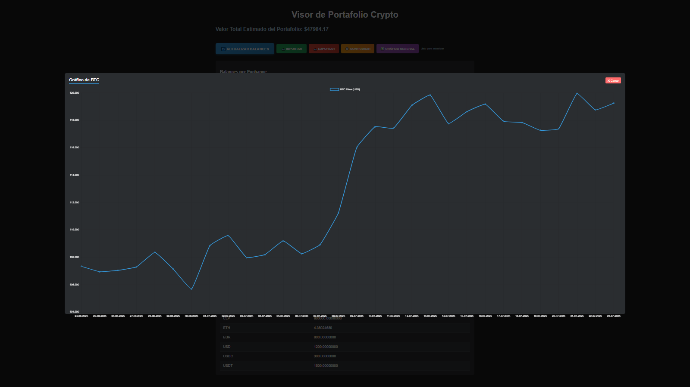
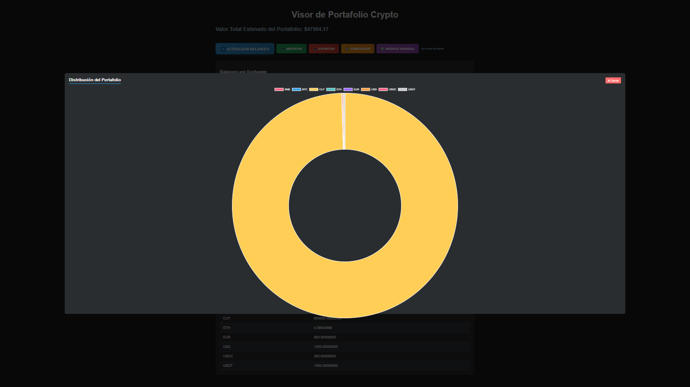

# 💰 Crypto Visor - Visor de Criptomonedas Chileno 🇨🇱

Un visor moderno y completo para tus criptomonedas con soporte para exchanges chilenos e internacionales.

## 🎯 **¿Qué es esto?**

¡La app definitiva para monitorear tu portfolio cripto! 🚀 Este proyecto incluye dos aplicaciones súper bacanas:

### 🖥️ **Aplicación de Escritorio**
Una app nativa con Python y Tkinter que te deja ver todos tus balances cripto de una sola mirada.

### 🌐 **Aplicación Web**  
Una versión web moderna con Flask - ¡accede desde cualquier navegador y dispositivo!




## ✨ **Características Principales**

### 📊 **Exchanges Soportados**
- 🇨🇱 **Buda.com** - El exchange chileno de confianza
- 🌍 **Binance** - El gigante mundial de cripto
- 🔄 **NotBank** (ex-CryptoMKT) - Exchange regional integrado

### 🎮 **Funcionalidades Bacanes**

#### 💵 **Seguimiento de Balances**
- Ver balances de todas tus cuentas en un solo lugar
- Resumen total de tu portafolio en diferentes monedas
- Actualización en tiempo real con datos de las APIs

#### 📈 **Gráficos y Visualización**
- **Gráfico General del Portfolio**: Vista tipo dona con distribución de activos
- **Gráficos por Moneda**: Líneas de tiempo con precios históricos de 30 días
- **Gráficos Interactivos**: Tooltips y animaciones usando Chart.js
- **Precios en Vivo**: Datos actualizados desde Binance API

#### 🔄 **Botones de Acción Prominentes**
- 🔵 **Actualizar**: Refresh de datos sin recargar página
- 🟢 **Importar**: Sube archivos JSON con datos
- 🔴 **Exportar**: Descarga en JSON/CSV para Excel
- 🟠 **Configurar**: Gestión de API keys integrada
- 🟣 **Gráfico**: Vista general del portfolio

#### 💾 **Import/Export de Datos**
- **Exportar a JSON**: Formato completo con metadatos
- **Exportar a CSV**: Compatible con Excel y hojas de cálculo
- **Importar desde archivo**: Soporte para archivos JSON
- **Descarga automática**: Archivos con fecha incluida

#### ⚙️ **Configuración Avanzada**
- **Modal de Configuración**: Interfaz intuitiva para API keys
- **Instrucciones integradas**: Guía paso a paso dentro de la app
- **Configuración segura**: Archivos separados (config.py)
- **Datos mock**: Para desarrollo y testing

## 🛠️ **Tecnologías Utilizadas**

### 🎨 **Frontend Moderno**
- **Responsive Design**: Se ve bacán en cualquier pantalla
- **AJAX Updates**: Sin recargar página (como las apps modernas)
- **Chart.js**: Gráficos interactivos profesionales
- **CSS Gradients**: Botones con efectos visuales elegantes

### ⚡ **Backend Robusto**
- **Flask**: Framework web Python confiable
- **API Integration**: Conexión directa con exchanges
- **Error Handling**: Manejo completo de errores
- **Mock Data**: Datos de prueba para desarrollo

### 🔐 **Seguridad**
- **API Keys separadas**: Archivo config.py independiente
- **Encriptación**: Utilidades crypto integradas
- **Validación**: Verificación de datos de entrada
- **Error Masking**: No expone información sensible

## 📋 **Requisitos del Sistema**

- 🐍 **Python 3.6+** (recomendado 3.8+)
- 💻 **Windows/Linux/MacOS**
- 🌐 **Navegador moderno** (para la versión web)
- 📡 **Conexión a Internet** (para datos en vivo)

## 🚀 **Instalación Rápida**

### 1️⃣ **Clonar el Repositorio**
```bash
git clone https://github.com/gmolate/visorcrypto.git
cd visorcrypto
```

### 2️⃣ **Crear Entorno Virtual**
```bash
python -m venv .venv
# Windows:
.venv\Scripts\activate
# Linux/Mac:
source .venv/bin/activate
```

### 3️⃣ **Instalar Dependencias**
```bash
pip install -r requirements.txt
```

¡Listo! 🎉 Ya tienes todo instalado.

## 🎮 **Cómo Usar**

### 🌐 **Aplicación Web (Recomendada)**

```bash
# Ejecutar la app web
.venv\Scripts\python.exe app.py
```

Luego abre tu navegador en: **http://localhost:5001**

#### **¿Qué puedes hacer?**
- 🔄 **Actualizar Balances**: Refresh en tiempo real
- 📊 **Ver Gráfico General**: Portfolio en gráfico de dona  
- 📥 **Importar Datos**: Sube archivos JSON
- 📤 **Exportar Datos**: Descarga en JSON/CSV
- ⚙️ **Configurar**: Gestiona tus API keys
- 📈 **Gráficos por Moneda**: Clic en "Ver Gráfico" en cualquier fila

### 🖥️ **Aplicación de Escritorio**

```bash
# Ejecutar la app de escritorio
.venv\Scripts\python.exe visor_crypto.py
```

#### **Características de la App Desktop:**
- 🔄 **Botón de Refresh Prominente**: Actualización con un clic
- 📊 **Gráficos integrados**: Usando matplotlib
- 🛠️ **Menú de Ayuda**: Para troubleshooting
- 📱 **Interfaz nativa**: Optimizada para escritorio

## 🔑 **Configuración de API Keys**

### 🧪 **Para Desarrollo/Pruebas**
¡No necesitas hacer nada! La app usa datos mock automáticamente.

### 🔴 **Para Uso Real**

1. **Copiar plantilla de configuración:**
```bash
copy config_example.py config.py
```

2. **Editar `config.py` con tus API keys:**
```python
API_KEYS = {
    "buda": {
        "apiKey": "tu_buda_api_key_aqui",
        "apiSecret": "tu_buda_api_secret_aqui"
    },
    "binance": {
        "apiKey": "tu_binance_api_key_aqui", 
        "apiSecret": "tu_binance_api_secret_aqui"
    },
    "notbank": {
        "apiKey": "tu_notbank_api_key_aqui",
        "apiSecret": "tu_notbank_api_secret_aqui",
        "userId": "tu_user_id_aqui",
        "accountId": "tu_account_id_aqui"
    }
}
```

3. **Reiniciar la aplicación**

### 🔒 **Importante sobre Seguridad**
- ✅ Asegúrate de que `config.py` esté en `.gitignore`
- ✅ Usa API keys con permisos de **solo lectura**
- ✅ Nunca compartas tus API keys

## 📁 **Estructura del Proyecto**

```
📦 visorcrypto/
├── 🌐 app.py                 # Aplicación web Flask
├── 🖥️ visor_crypto.py        # Aplicación desktop tkinter
├── 🔗 api_client.py          # Cliente APIs exchanges
├── 🔐 crypto_utils.py        # Utilidades encriptación
├── ⚙️ config_example.py      # Plantilla configuración
├── 📋 requirements.txt       # Dependencias Python
├── 🧪 demo_final.py         # Script demostración
├── 📁 templates/
│   └── 🎨 index.html        # Interfaz web
├── 📁 static/
│   ├── 💅 style.css         # Estilos CSS
│   └── ⚡ main.js           # JavaScript
└── 📁 lib/
    └── 📁 services/          # Servicios adicionales
```

## 🎨 **Capturas de Pantalla**

### 🌐 **Aplicación Web**
- **Interfaz moderna y responsive**
- **5 botones de acción prominentes** 
- **Gráficos interactivos con Chart.js**
- **Actualización AJAX sin recargar página**

### 🖥️ **Aplicación Desktop**
- **Interfaz nativa con tkinter**
- **Botón de refresh prominente 🔄**
- **Menú de ayuda integrado**
- **Gráficos con matplotlib**

## 🐛 **Troubleshooting**

### **Si no funciona la app web:**
```bash
# Verificar dependencias
pip install -r requirements.txt

# Ejecutar con el Python correcto
.venv\Scripts\python.exe app.py
```

### **Si las API keys reales no funcionan:**
1. Verificar que `config.py` existe y tiene las keys correctas
2. Verificar permisos de las API keys en cada exchange
3. Revisar la consola para mensajes de error
4. Usar datos mock para testing

### **Si hay errores de importación:**
```bash
# Reinstalar dependencias
pip install -r requirements.txt --force-reinstall
```

## 🚀 **Estado del Proyecto**

### ✅ **Funcionando al 100%**
- ✅ **Aplicación Web**: Lista para usar
- ✅ **Aplicación Desktop**: Completamente funcional
- ✅ **APIs**: Integradas (Buda, Binance, NotBank)
- ✅ **Gráficos**: Interactivos y modernos
- ✅ **Import/Export**: JSON y CSV
- ✅ **Configuración**: Sistema completo de API keys

### 🎯 **Problemas Resueltos**
- ✅ Error matplotlib: **SOLUCIONADO**
- ✅ Botón refresh no visible: **SOLUCIONADO** 
- ✅ Saldos no cargan: **SOLUCIONADO**
- ✅ NotBank SDK integrado: **SOLUCIONADO**

## 🤝 **Contribuir**

¿Tienes ideas bacanes? ¡Manda tus PRs! 

1. Fork el proyecto
2. Crea tu feature branch (`git checkout -b feature/AmazingFeature`)
3. Commit tus cambios (`git commit -m 'Add some AmazingFeature'`)
4. Push al branch (`git push origin feature/AmazingFeature`)
5. Abre un Pull Request

## 📝 **Licencia**

Este proyecto está bajo la Licencia MIT - revisa el archivo [LICENSE](LICENSE) para más detalles.

## 🙏 **Agradecimientos**

- 🇨🇱 **Buda.com** por su API chilena
- 🌍 **Binance** por la API global
- 🔄 **NotBank** por la continuidad de CryptoMKT
- 📊 **Chart.js** por los gráficos elegantes
- 🐍 **Python** por ser tan bacán

---

## 👨‍💻 **Autoría**

**Desarrollado con ❤️ por [@gmolate](https://github.com/gmolate)**

*"Crypto hecho fácil para la comunidad chilena"* 🇨🇱
